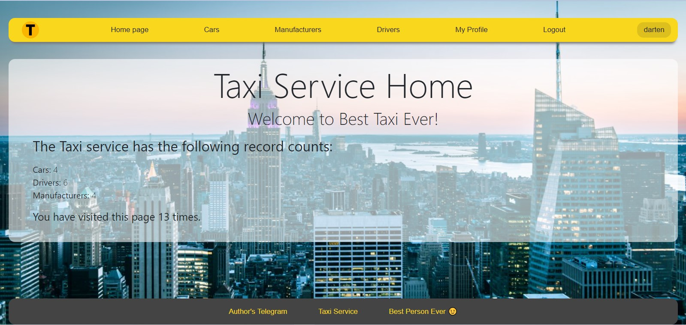

# taxi-service-darten

Django project for managing cars, drivers and manufacturers

[Taxi-service project deployed to Heroku](Paste Url later)

## Installation

```shell
git clone git@github.com:darten360/taxi-service-darten.git
cd taxi-service-darten
python3 -m venv venv
source venv/bin/activate
pip install -r requirements.txt
python manage.py runserver
```

## Demo User
```angular2html
username: user
password: user12345
```
## Demo

